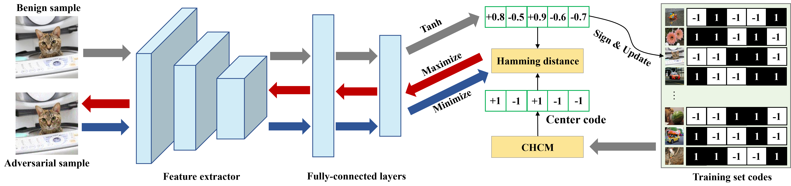

# CgAT: Center-Guided Adversarial Training for Deep Hashing-Based Retrieval
This is the official code for [CgAT: Center-Guided Adversarial Training for Deep Hashing-Based Retrieval](https://arxiv.org/abs/2204.10779) (WWW 2023).



In this paper, we present a min-max based Center-guided Adversarial Training, namely CgAT, to improve the robustness of deep hashing networks through worst adversarial examples. Our key idea is to formulate a hash code (dubbed center code) as a discriminative semantic representation of the original sample, which can be used to guide the generation of the powerful adversarial example and as an accurate optimization objective for adversarial training.


## Requirements
My dependencies are as follows:
- python 3.9.12
- pytorch 1.12.0
- torchvision 0.13.0
- pillow 9.0.1
- numpy 1.21.5
- cudatoolkit 11.3.1


## Quick Start
### Train hashing models
Initialize the hyper-parameters in hashing.py following the paper, and then run
```
python hashing.py
```
### Adversarial training
Initialize the hyper-parameters in central_adv_train.py according to the paper, and then run
```
python central_adv_train.py
```


## Citation
If you find this work is useful, please cite the following:
```
@inproceedings{wang2023cgat,
  title={CgAT: Center-Guided Adversarial Training for Deep Hashing-Based Retrieval},
  author={Wang, Xunguang and Lin, Yiqun and Li, Xiaomeng},
  booktitle={Proceedings of the ACM Web Conference (WWW)},
  year={2023}
}
```
